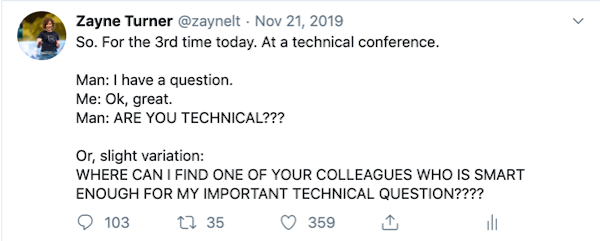
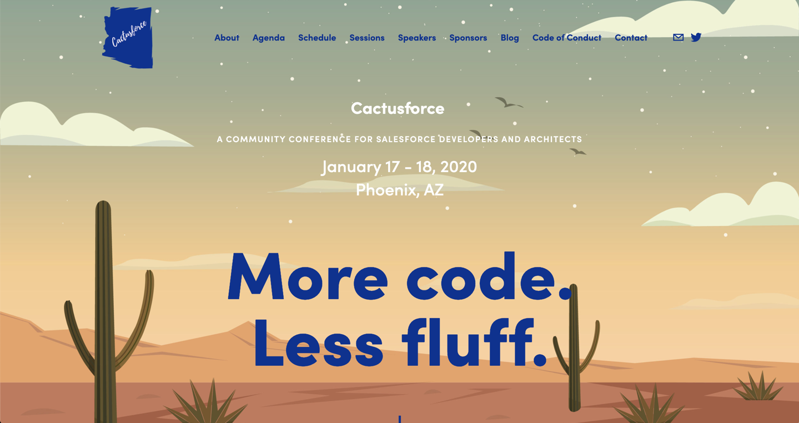
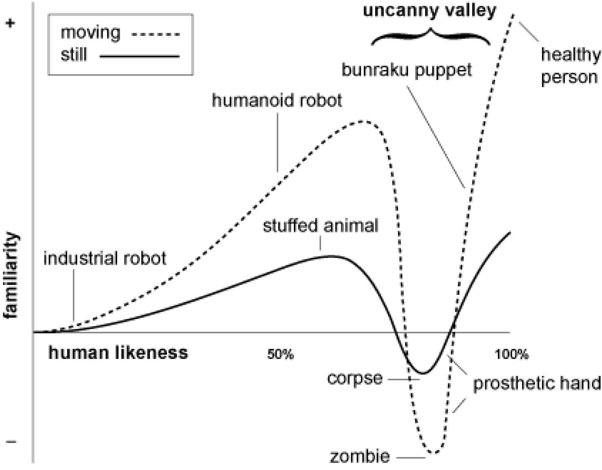
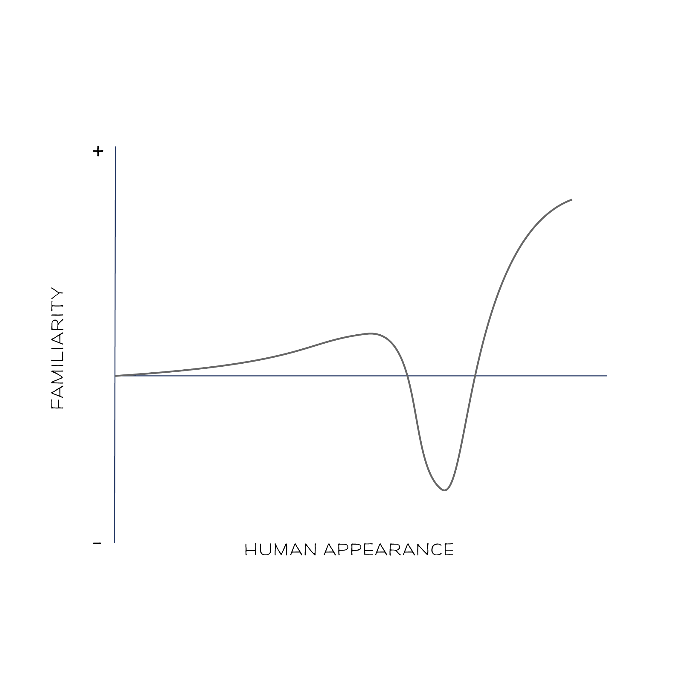
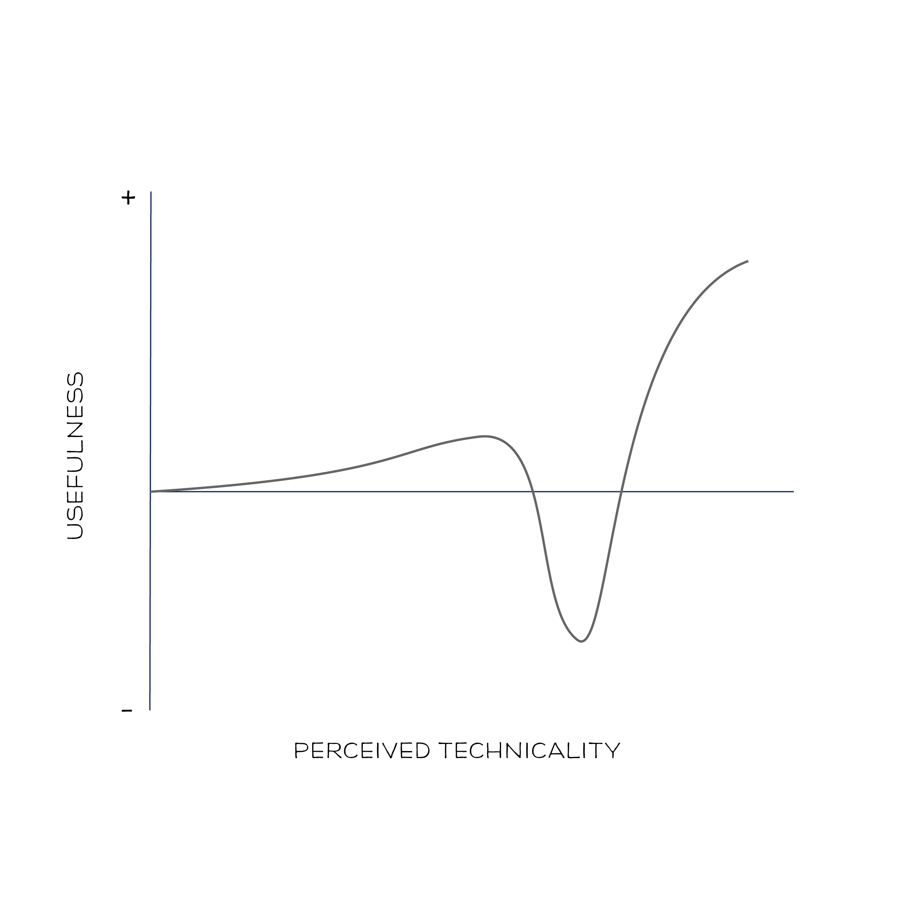
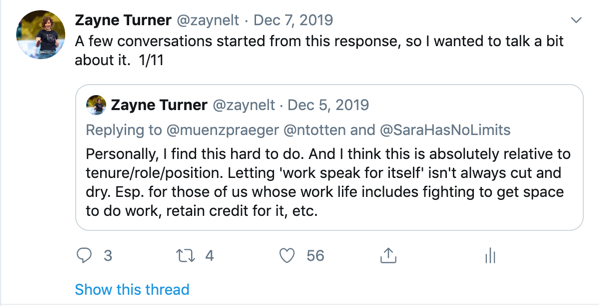

-
# A Practitioner's Guide to Debugging Fluff

Zayne Turner
Principal Architect Evangelist, Salesforce
@zaynelt

---

##A Practitioner's Guide to Debugging Fluff

---

## What it means to be technical

---

### Has been on my mind lately.

---

# What even is technical?

---

-
-

# Different words, same thing.

Technical, non-technical
Hard, Soft

---

---

## What do we mean?

---

---

### This is about *perception*.

---

#  Uncanny Valley
## perception graph

#### Original uploader: Macdorman at English Wikipedia

---

## Let's use at this perception framework

---
## And modify it for 'technicality'

---

Why does this matter for learning or being a *technical* practitioner?

---

Why does this matter for *Salesforce* practitioners?

---

### Case Study: Guest Checkout Functionality

---

-
# Problem: No unauthenticated check outs 

* Passwords over the phone
* Paper, paper, paper
* No ability to grow lines of business

---

-
# Solution: Checkout as Guest

* Secure phone support
* Reduced paper operations
* Allowed more ad hoc ‘products’ online
* Automated connection to accounting

---
-
-
##Annual planning: 

Should we eliminate paper and use shopping cart only?

---

-
## Yays:

* Marketing
* Development
* Accounting, Ops
* Education staff
* IT

---

-
## Nays:

* Education Leader

---

# Motion: Failed

---

Let me introduce you to the Education Leader

---

---

I avoided working directly with them.

---

-
-
-
-

I got more *code* written and deployed. 

And failed *to be a leader*.

---
-
### What I didn't think of that mattered:

* $$ impact of paper apps (cost-to-serve)
* $$ value of paper apps
* Enablement campaign ideas
* Phased elimination options

---

-
# The best solution

* is approachable
* is adoptable
* makes the *business happy*.

---

### Well-crafted tech 
-
### deployed so it cannot *thrive* 
-
### is indistinguishable from bad tech

---

## What is unique about Salesforce technologists?

---

# Being a practitioner of:

* decreased time-to-market
* democratized learning 
* clicks and code

## *is not your unique value*.

---

## *You* change business.

---

## Let’s go back to our comparison

---

The fluff/not fluff Uncanny Valley is different for everyone.

---

Fluff *!=* easy to understand
Fluff *!=* widely applicable
Fluff *= a personal judgement*

---

## Avoid weaponizing your distinctions.

---
### This is personal for me.

---

### And lots of other folks:

---

Don't limit your ability to *thrive*.

---

Don't limit your ability to *deliver* solutions that *thrive*.

---

This is the beginning of a conversation. 

What is being technical to *you*?

---

# Thank you.

