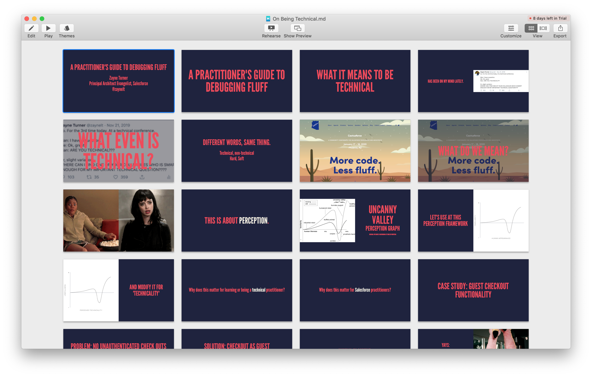

## Fluffer Debugger, or, A Presentation On Being Technical in Markdown

A presentation written in Markdown. This presentation looks at how people make technical distinctions, and why that matters for Salesforce practitioners. Originally presented at [Cactusforce](https://www.cactusforce.com/) 2020, using [Deckset](https://www.deckset.com/).

Feel free to fork, add your own images and case study(ies) of times you did bad things at work, and use the Markdown-to-Slides generator/library/app of choice to spread the conversation. :) 

Note: The characatures in these slides reflect the perceptions of the author, rather than accurate statements about actual humans.

